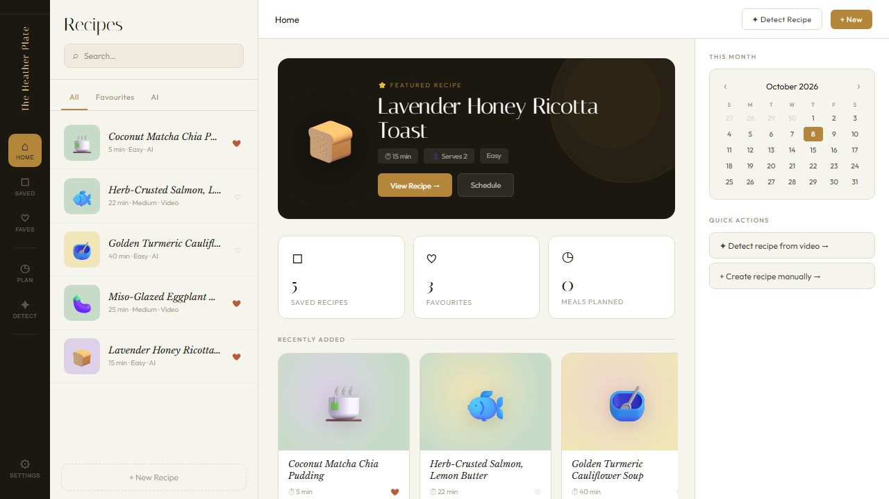

# The Heather Plate

**An AI recipe organizer: paste a recipe link from Instagram, TikTok, or YouTube and get back a clean, saved recipe.** Made for my mom 🩷

<p align="center">

</p>

## Features

- **Detect a recipe:** paste a link to a recipe video or post, and Gemini pulls out the ingredients and steps
- **Recipe library:** search, favourites, and an "AI" tab for recipes the AI detected
- **Featured recipe & quick stats:** saved recipes, favourites, and meals planned at a glance
- **Meal planning:** a calendar to schedule recipes by day
- **Create and edit recipes by hand**, too

## Tech

React (Create React App) · Google Gemini API · browser storage for saved recipes

## Run it locally

```bash
npm install
npm start
```

To turn on AI detection, create a `.env` file with `REACT_APP_GEMINI_KEY=your_key` (never commit this file).

A mobile version in React Native / Expo is in progress.

## Author

**Lilla Tillo** · [GitHub](https://github.com/lilltill7)
